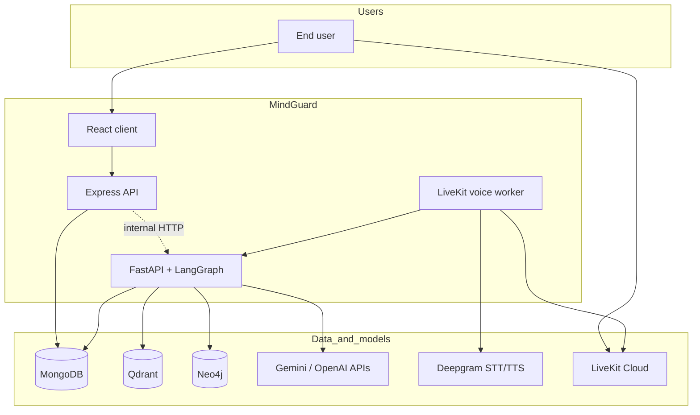
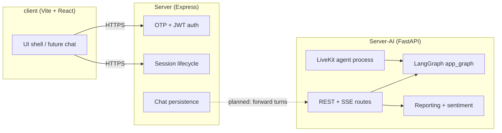
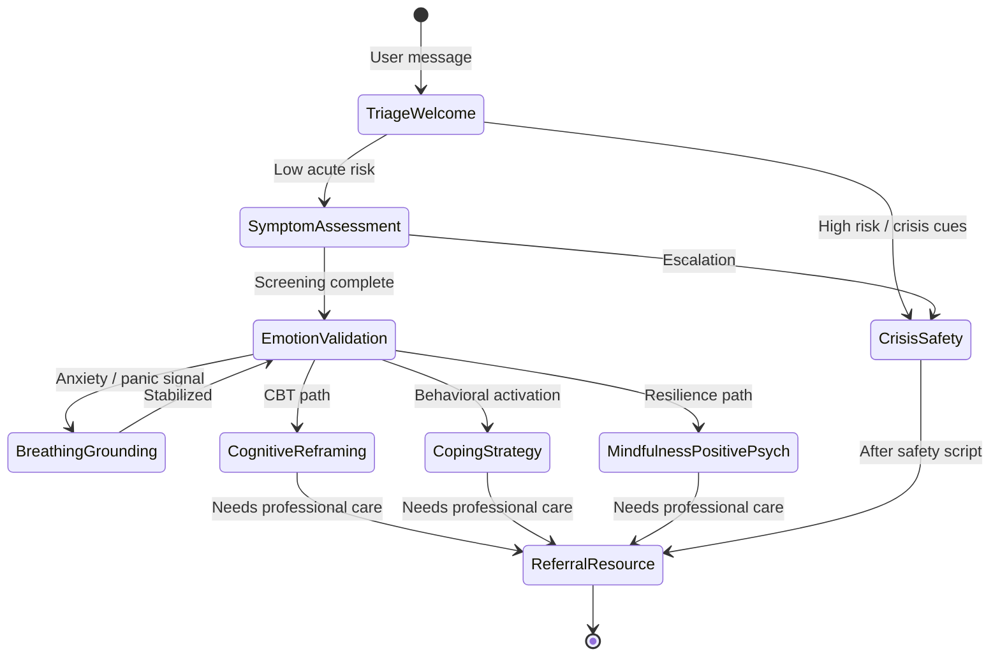
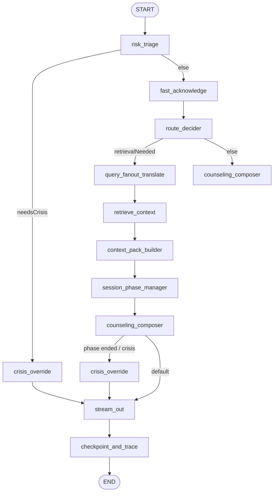
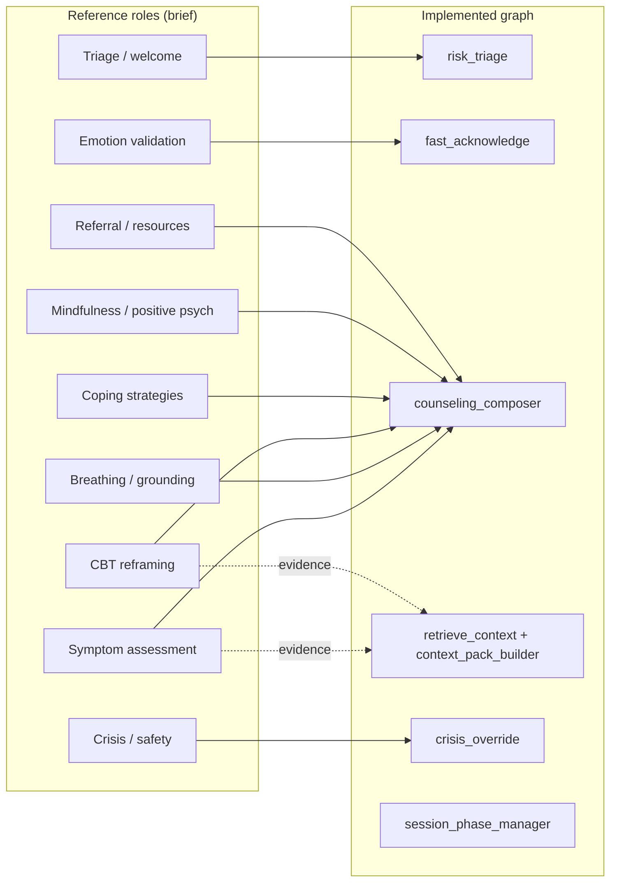
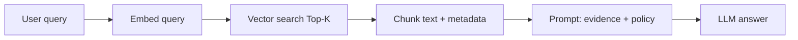
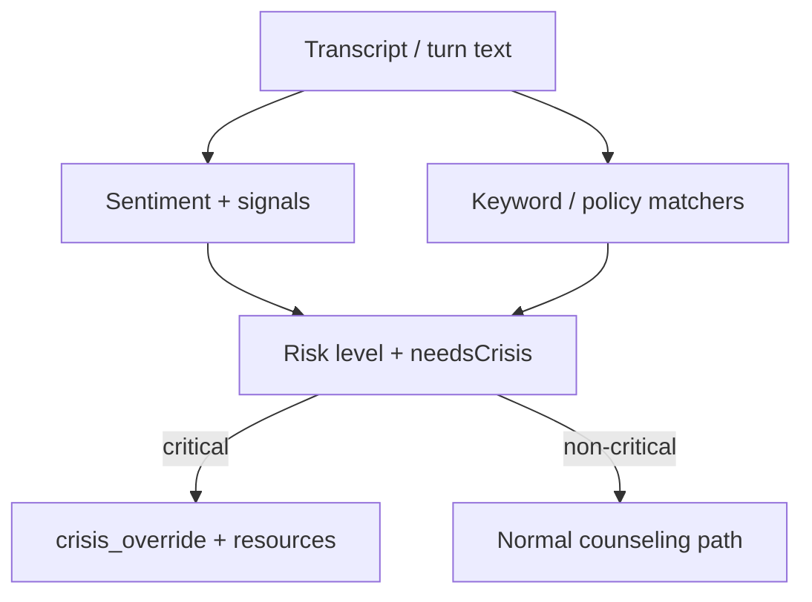
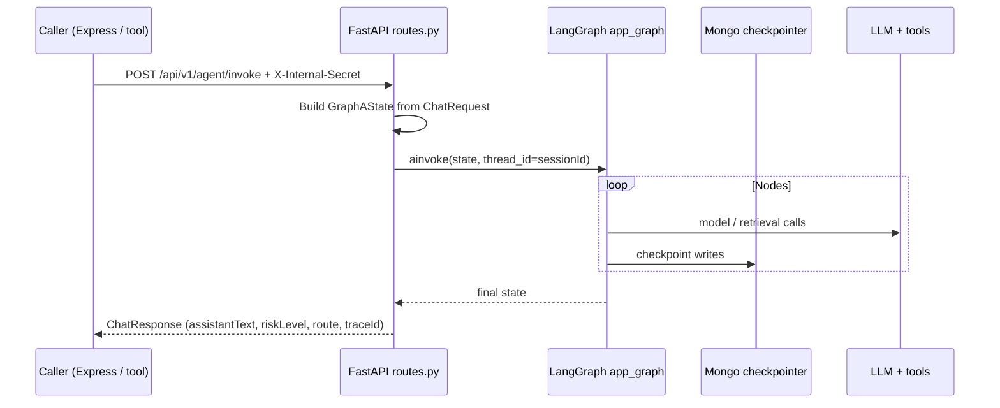
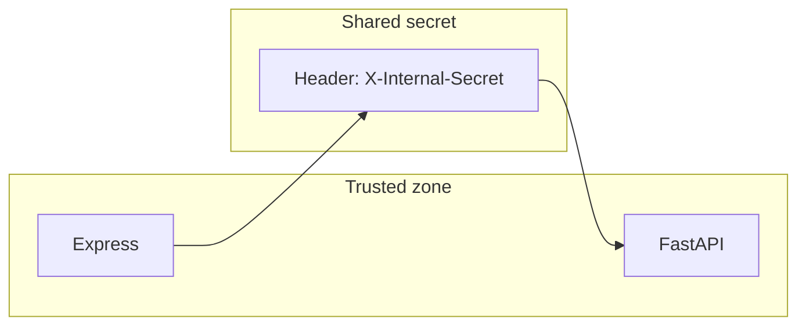

# MindGuard — Architecture

This document describes how the **client**, **API server**, and **AI microservice** fit together; how the **reference design** (therapeutic state machine) relates to the **implemented LangGraph**; and how **RAG**, **memory**, and **safety** layers interact. Diagrams use [Mermaid](https://mermaid.js.org/).

---

## 1. System context

Who talks to whom at the ecosystem boundary.

**Notes**

- Express persists **users**, **sessions**, and **chat logs** (`Server/src/models`).
- The AI service should be called from a **trusted backend** using `X-Internal-Secret`, not exposed with provider keys to browsers in production.
- Voice: **LiveKit** + **Deepgram**; reasoning in `Server-AI/src/livekit/langgraph_llm.py` and `Server-AI/src/agents/voice_agent.py`.

---

## 2. Container view (logical components)

**Integration status**

- `chat.controller.ts` still returns a **placeholder** AI message; wire to `/api/v1/agent/invoke` or `/api/v1/agent/stream`.
- `session.controller.ts` has **TODO** hooks for LiveKit/AI binding and report generation on session end.

---

## 3. Reference design: therapeutic multi-agent graph (problem statement)

The project brief describes a **supervisor-style LangGraph** with **nine functional roles** and **conditional routing** (conceptual). This is the **product/intent** layer—not a line-for-line match to `node.py` names.

**Reference routing ideas (from brief)**

- Elevated **risk score** → prioritize **Crisis & safety** and **Referral & resource** flows.  
- **Anxiety / panic** signals → **Breathing & grounding** before deeper cognitive work.  
- **Shared state** (conceptual): user id, transcript, emotional/risk summary, visited intents, session duration.

---

## 4. Implemented LangGraph pipeline (Graph A)

Built in `Server-AI/src/agents/graph.py`, compiled with **MongoDB checkpointer** (`langgraph-checkpoint-mongodb`). State: `GraphAState` in `Server-AI/src/agents/state.py`.

### 4.1 Node-level flowchart

**Node intent**

| Node | Role |
|------|------|
| `risk_triage` | Safety classification; crisis short-circuit. |
| `fast_acknowledge` | Low-latency empathy before heavier steps. |
| `route_decider` | Whether to run retrieval (RAG / memory / graph tools). |
| `query_fanout_translate` | Query generation for heterogeneous stores. |
| `retrieve_context` | Pull into `rag`, `memory`, related slices. |
| `context_pack_builder` | Merge into `contextPack.mergedContext` + `sourcesMeta`. |
| `session_phase_manager` | Phases: `opening` → `working` → `closing` → `ended`. |
| `counseling_composer` | Main reply; may escalate if safety changes. |
| `crisis_override` | Safety-first message path. |
| `stream_out` | Events/tokens for SSE. |
| `checkpoint_and_trace` | Checkpoint + trace metadata. |

> **Note:** `graph.py` registers more than one conditional edge set from `counseling_composer`. Treat the diagram as the **intended** control flow and consolidate edges when evolving the graph.

### 4.2 Mapping: reference nine roles → implemented nodes

Therapeutic “modes” in the brief are **composed inside** LLM prompts and routing metadata rather than each being a separate compiled graph node today.

---

## 5. RAG and context (reference vs code)

**Reference pipeline**

**This repository**

- **Vector DB:** Qdrant (`COLLECTION_NAME`, mem0 collection in `mem0_config.py`).  
- **Embeddings:** OpenAI (`text-embedding-3-small` in mem0 config; RAG stack aligned in agents/tools).  
- **Chunking:** Configure at ingestion time; the brief suggests **512 tokens / 50 overlap** as a baseline for knowledge PDFs.

---

## 6. Risk analysis (reference vs code)

The brief describes a **scoring pipeline** (sentiment models, NER, regex crisis lexicon, weighted score → JSON report). The codebase implements **graph-level triage and override** plus separate **HTTP helpers** (`/analyze/sentiment`, `/analyze/report`). Treat scoring weights in the PDF as **design guidance**; align implementations explicitly when you harden production policy.

---

## 7. Request path: non-streaming invoke

---

## 8. Data stores

| Store | Used for |
|-------|-----------|
| **MongoDB** | App data (Mongoose); LangGraph checkpoints (`CHECKPOINT_DB_NAME`). |
| **Qdrant** | Knowledge base + mem0 vector collections. |
| **Neo4j** | mem0 graph store (`mem0_config.py`). |

---

## 9. Security model (baseline)

- Rotate `AI_SERVICE_SECRET` per environment.  
- Never ship provider API keys to the browser.  
- JWT verification: `Server/src/middleware/auth.middleware.ts`.

---

## 10. Related files

| Area | File |
|------|------|
| AI HTTP | `Server-AI/src/api/routes.py` |
| Graph | `Server-AI/src/agents/graph.py` |
| State | `Server-AI/src/agents/state.py` |
| Nodes | `Server-AI/src/agents/node.py` |
| Voice | `Server-AI/src/agents/voice_agent.py` |
| Express | `Server/src/app.ts` |
| Session / chat | `Server/src/controllers/session.controller.ts`, `chat.controller.ts` |
